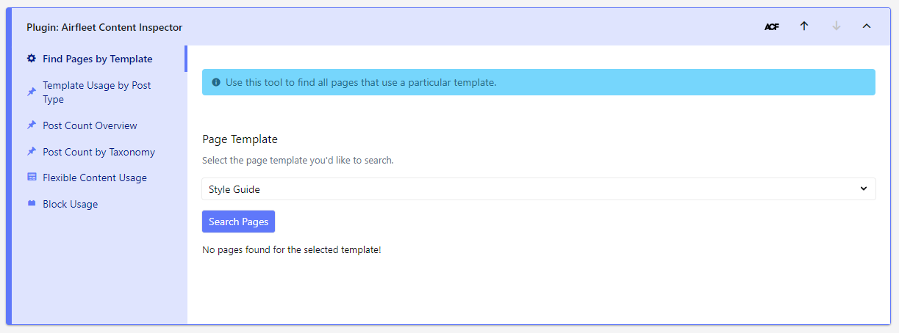

# Airfleet Content Inspector

Description: Find pages by template, find pages where block is used, posts overview, section search.
Status: Active
Repository: https://github.com/airfleet/airfleet-content-inspector-plugin
Changelog: https://github.com/airfleet/airfleet-content-inspector-plugin/releases
Asana: https://app.asana.com/0/1204467626651082/list
Licensing: Support
Tags: Tool

[https://cc-kh-8554c.web.app/0493ba61bbd6493d9d64f85c50d20edb/Airfleet%20Content%20Inspector](https://cc-kh-8554c.web.app/0493ba61bbd6493d9d64f85c50d20edb/Airfleet%20Content%20Inspector)

# 🗳️ Requirements

- PHP 8
- Advanced Custom Fields PRO

# 💁 Introduction

[content-inspector-intro.mp4](content-inspector/content-inspector-intro.mp4)

# 🧪 Features

<aside>
ℹ️ Content Inspector can be found under Tools menu.

</aside>

### Find Pages by Template

Find all pages that use a particular template.

### Template Usage by Post Type

How frequently is each template used in a particular post type.

### Post Count Overview

Lists out the number of posts for each post type.

### Post Count by Taxonomy

Lists out the number of posts for each taxonomy / term.

### Flexible Content Usage

This feature allows administrators to:

1. Generate a list of all ACF Flexible Content sections ordered by usage frequency
2. Find all pages that use a particular ACF Flexible Content section.

### Block Usage

Find all pages that use a particular block.

<aside>
⚠️ This will only find blocks currently registered with ACF.

</aside>

